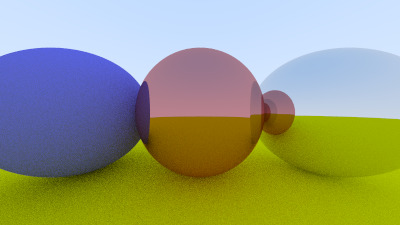

# C++ Ray Tracer
  
Build: `cmake --preset release && cmake --build --preset release` 
Run: `build/release/bin/raytracer > image.ppm`
### Example images:
###### Final scene with focus distance & camera positioning ([commit](https://github.com/allenvox/ray-tracer/tree/2baa99a02b6073fc3e651fb14606d44bfc3f6687))

###### Hollow glass sphere (left) ([commit](https://github.com/allenvox/ray-tracer/tree/1d11530e40c7f58e5b4530ce218c51b08c3e0353))

###### Fuzzed metal material on center (fuzz 0.3) & left spheres (fuzz 1.0) ([commit](https://github.com/allenvox/ray-tracer/tree/4912576d73af69980262939c4155eb8ec0b7e925))

###### Metal & Lambertian sphere materials ([commit](https://github.com/allenvox/ray-tracer/tree/98c76d39869021d35ad793d6fbec21954396d843))

###### Diffuse sphere with no shadow acne ([commit](https://github.com/allenvox/ray-tracer/tree/8bf74026fe05d62e404a57aa4a8a90bd79651bcd))

###### Diffuse sphere ([commit](https://github.com/allenvox/ray-tracer/tree/12f7e0e9929322bcb155471779ce426db12a5cd1))

###### Sphere with antialiasing ([commit](https://github.com/allenvox/ray-tracer/tree/580a02dffecbed07362f1b632d736bb5a16b3565))

###### Gradient sphere in a world with ground & sky ([commit](https://github.com/allenvox/ray-tracer/tree/266b1e426b31ecb2b4cb4b20fe7b1e9b47c199e9))

###### Simple sky ([commit](https://github.com/allenvox/ray-tracer/tree/b34d3c142cb37209aaaf5b242efd3f728f1a0066))

###### Simple gradients ([commit](https://github.com/allenvox/ray-tracer/tree/8744b4b397affb99e536a181ebe93696a20f33f1))

